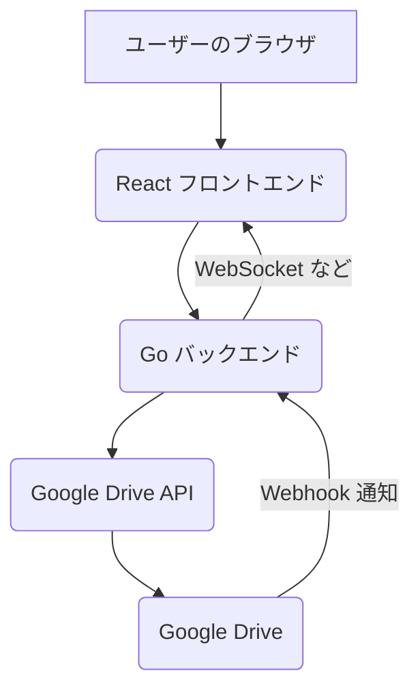

# Google Drive Media Gallery

## Project Goal
Google Drive の特定のフォルダにある画像、動画、音声ファイルをウェブサイト上に表示し、動的に更新を反映する。

## Specifications

*   **対象フォルダ:** 「リンクを知っている全員が編集者」として共有されている特定の Google Drive フォルダ。
*   **表示形式:** ウェブサイト上でファイルをグリッド表示し、動画と音声を再生可能にする。
*   **動的更新:** Google Drive Webhook を利用し、バックエンドからの通知でリアルタイムに表示を更新する。

## Technology Stack

*   **フロントエンド:** TypeScript + React
*   **バックエンド:** Go
*   **API連携:** Google Drive API
*   **デプロイ:** GCP Cloud Run

## Architecture

## Development Progress

### Backend (Go)
*   [x] プロジェクトディレクトリ (`dev/drive-gallery`) の中に、フロントエンド (`frontend`) とバックエンド (`backend`) のディレクトリを作成。
*   [x] Go バックエンドの初期セットアップ（モジュールの初期化、`go.mod` をルートに配置）。
*   [x] Google Drive API と連携するための Go コードを実装（OAuth 2.0 認証、ファイル一覧取得、フォルダ一覧取得）。
*   [x] Webhook 通知を受け取るための基本的な Go エンドポイント (`/webhook`) を実装。
*   [x] バックエンドアプリケーションのビルド成功。
*   [x] Webhook 通知ヘッダーの解析とログ出力処理を実装。
*   [x] WebSocket サーバー機能を実装（クライアント管理、ブロードキャスト）。
*   [x] API エンドポイントの拡充:
    *   [x] `/api/folders`: ルートフォルダ直下のフォルダ一覧を取得。
    *   [x] `/api/files/{folderId}`: 指定されたフォルダ内のファイル一覧を取得。
*   [x] CORS 設定を追加。
*   [x] `webContentLink` をファイル取得時に含めるように修正。

### Frontend (React + TypeScript)
*   [x] Vite + React + TypeScript プロジェクトのセットアップ完了。
*   [x] ルーティング設定 (`react-router-dom`):
    *   [x] `/`: ルートフォルダ内のフォルダ一覧を表示 (`HomePage`)。
    *   [x] `/folder/:folderId`: 指定フォルダ内のファイル一覧を表示 (`FolderPage`)。
*   [x] `HomePage` コンポーネント:
    *   [x] バックエンド API (`/api/folders`) からフォルダリストを取得し表示。
    *   [x] フォルダクリックで該当フォルダの `FolderPage` へ遷移。
*   [x] `FolderPage` コンポーネント:
    *   [x] バックエンド API (`/api/files/:folderId`) からファイルリストを取得しグリッド表示。
    *   [x] WebSocket に接続し、メッセージ受信時にファイルリストを再取得。
    *   [x] ファイルタイプに応じたプレビュー表示:
        *   [x] 画像: `webContentLink` または `thumbnailLink` を使用して `` で表示。
        *   [x] 動画・音声: Google Drive の埋め込みプレビュー (`<iframe>`) で表示。
        *   [x] その他: ファイルアイコンとファイル名を表示し、`webViewLink` で開く。
    *   [x] 動画ファイルクリック時に、拡大表示された動画プレーヤーを表示。

### Next Steps

1.  **Backend Refinement:**
    *   [ ] Webhook 通知データの詳細な処理ロジックを実装（`resourceState` に応じて具体的な変更内容を WebSocket でフロントエンドに通知）。
    *   [x] Google Drive API のエラーハンドリング強化（ページネーション対応など）。
    *   [ ] 認証情報（`credentials.json`, `token.json`）のセキュアな管理方法の確立。
    *   [ ] WebSocket 通信のセキュリティ向上（Originチェックの厳格化など）。
2.  **Frontend Development:**
    *   [ ] UI/UX の改善:
        *   [x] ローディングスピナー、エラー表示の改善。
        *   [ ] ファイル一覧のページネーション（ファイル数が多い場合）。
        *   [ ] より洗練されたグリッドレイアウト。
        *   [ ] 音声ファイルの埋め込み再生の改善（現状は動画と同じプレビュー）。
    *   [ ] WebSocket からの具体的な変更通知（例: ファイル追加、削除）に応じた部分的なUI更新（現状はリスト全体を再取得）。
3.  **Integration and Testing:**
    *   [ ] Google Drive Webhook を実際に設定し、ファイル変更時のリアルタイム更新をテスト。
    *   [ ] フロントエンドとバックエンドを連携させ、エンドツーエンドのテストを実施。
4.  **Deployment (GCP Cloud Run):**
    *   [ ] フロントエンドとバックエンドをデプロイ。
5.  **Further Enhancements (General):**
    *   [ ] 包括的なエラーハンドリングとロギング。
    *   [ ] パフォーマンス最適化。
    *   [ ] セキュリティ向上（入力バリデーション、レートリミットなど）。
