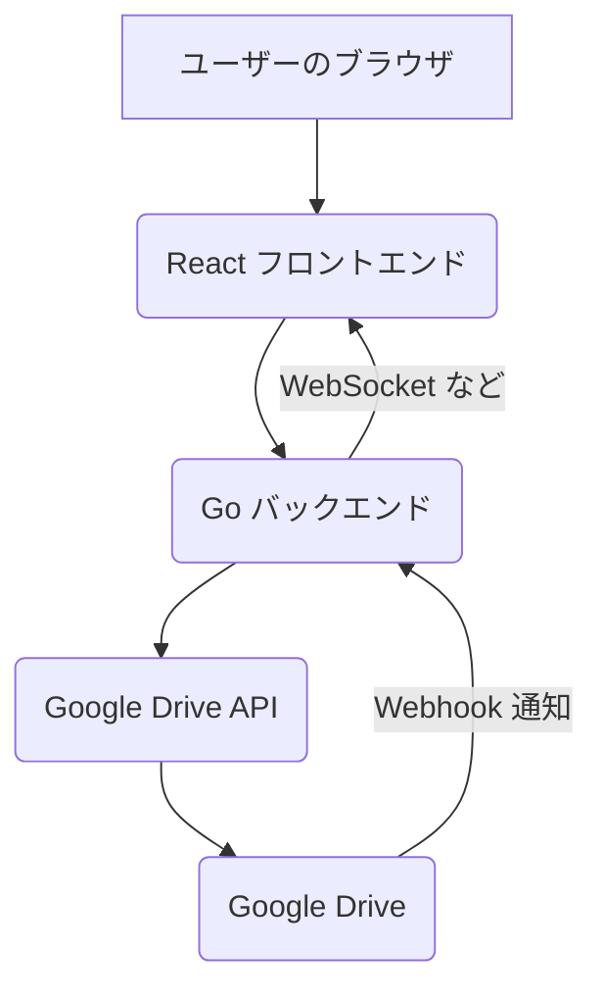

# Google Drive Media Gallery

## Project Goal
Google Drive の特定のフォルダにある画像、動画、音声ファイルをウェブサイト上に表示し、動的に更新を反映する。

## Specifications

*   **対象フォルダ:** 「リンクを知っている全員が編集者」として共有されている特定の Google Drive フォルダ。
*   **表示形式:** ウェブサイト上でファイルをグリッド表示し、動画と音声を再生可能にする。
*   **動的更新:** Google Drive Webhook を利用し、バックエンドからの通知でリアルタイムに表示を更新する。

## Technology Stack

*   **フロントエンド:** TypeScript + React
*   **バックエンド:** Go
*   **API連携:** Google Drive API
*   **デプロイ:** GCP Cloud Run

## Architecture

## Development Progress

### Backend (Go)
*   [x] プロジェクトディレクトリ (`dev/drive-gallery`) の中に、フロントエンド (`frontend`) とバックエンド (`backend`) のディレクトリを作成。
*   [x] Go バックエンドの初期セットアップ（モジュールの初期化、`go.mod` をルートに配置）。
*   [x] Google Drive API と連携するための Go コードを実装（OAuth 2.0 認証、ファイル一覧取得）。
*   [x] Webhook 通知を受け取るための基本的な Go エンドポイント (`/webhook`) を実装。
*   [x] バックエンドアプリケーションのビルド成功。
*   [x] Webhook 通知ヘッダーの解析とログ出力処理を実装。
*   [x] WebSocket サーバー機能を実装（クライアント管理、ブロードキャスト）。
*   [x] `/files` API のレスポンス形式を改善（JSON構造化）。
*   [x] CORS 設定を追加。

### Frontend (React + TypeScript)
*   [x] Vite + React + TypeScript プロジェクトのセットアップ完了。
*   [x] バックエンド API (`/files`) からファイルリストを取得し表示する機能を実装。
*   [x] ファイルタイプに応じたアイコン表示を実装。
*   [x] WebSocket に接続し、メッセージ受信時にファイルリストを再取得する機能を実装。

### Next Steps

1.  **Backend Refinement:**
    *   [x] Webhook 通知データの詳細な処理ロジックを実装。(基本的な解析とログ出力)
    *   [x] フロントエンドとのリアルタイム通信のための WebSocket サーバー機能を実装。
    *   [x] API エンドポイント (`/files`) のエラーハンドリングとレスポンス形式を改善。
2.  **Frontend (React + TypeScript) Setup:**
    *   [x] `frontend` ディレクトリに React + TypeScript プロジェクトを初期化。(完了済み)
3.  **Frontend Development:**
    *   [x] バックエンドからファイル情報を取得し、グリッド表示するコンポーネントを作成。(リスト表示とアイコン表示まで実装)
    *   [x] WebSocket を使用してバックエンドからの更新通知を受け取り、表示を更新する機能を実装。
    *   [x] 動画・音声ファイルの再生機能を実装。(アイコン表示と `webViewLink` で対応)
4.  **Integration and Testing:**
    *   Google Drive Webhook を実際に設定し、ファイル変更時のリアルタイム更新をテスト。
    *   フロントエンドとバックエンドを連携させ、エンドツーエンドのテストを実施。
5.  **Deployment (GCP Cloud Run):**
    *   フロントエンドとバックエンドをデプロイ。
6.  **Further Enhancements:**
    *   **Frontend:**
        *   ファイル一覧のグリッドレイアウト実装。
        *   画像、動画、音声ファイルの埋め込み再生機能の実装（`webContentLink` の利用検討）。
        *   ページネーションの実装（ファイル数が多い場合）。
        *   UI/UX の改善（ローディングスピナー、エラー表示の改善など）。
    *   **Backend:**
        *   Webhook 通知の `resourceState` に応じた詳細な処理ロジックの実装（例: `add`, `update`, `remove` でフロントエンドに具体的な変更内容を通知）。
        *   Google Drive API のエラーハンドリング強化。
        *   認証情報（`credentials.json`, `token.json`）のセキュアな管理方法の確立。
        *   WebSocket 通信のセキュリティ向上（Originチェックの厳格化など）。
    *   **General:**
        *   包括的なエラーハンドリングとロギング。
        *   パフォーマンス最適化。
        *   セキュリティ向上（入力バリデーション、レートリミットなど）。
