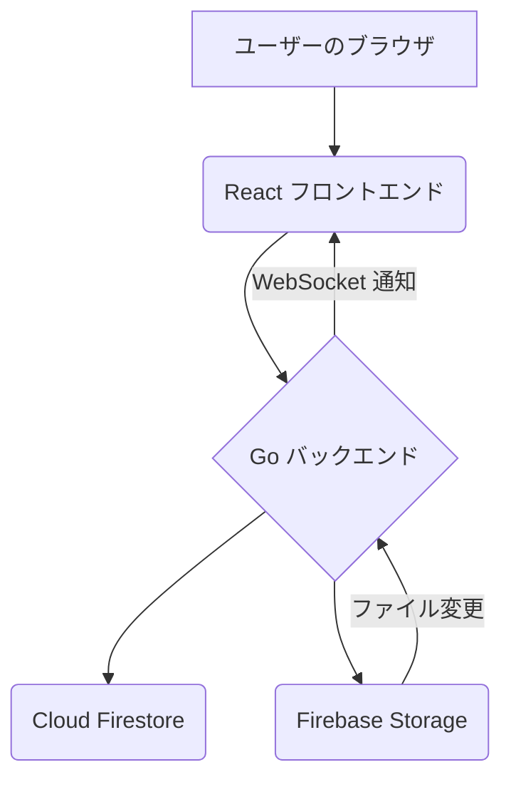

# Google Drive Media Gallery

## Project Goal
Firebase Storage に保存された画像、動画、音声ファイルをウェブサイト上に表示し、動的に更新を反映する。

## Specifications

*   **対象ファイル:** Firebase Storage にアップロードされた画像、動画、音声ファイル。
*   **表示形式:** ウェブサイト上でファイルをグリッド表示し、動画と音声を再生可能にする。
*   **動的更新:** バックエンドからの通知（WebSocket）でリアルタイムに表示を更新する。

## Technology Stack

*   **フロントエンド:** TypeScript + React
*   **バックエンド:** Go
*   **データベース:** Google Cloud Firestore
*   **ファイルストレージ:** Firebase Storage
*   **デプロイ:** GCP Cloud Run

## Architecture

*   ユーザーのブラウザはReactフロントエンドと通信します。
*   ReactフロントエンドはGoバックエンドのAPIを呼び出します。
*   GoバックエンドはCloud Firestoreと連携してファイルメタデータやプロフィール情報などの永続データを管理し、Firebase Storageと連携してファイルを保存・取得します。
*   Firebase Storageでのファイル変更は、必要に応じてバックエンドに通知され（例: Cloud Functions for Firebase を介したトリガー）、WebSocketなどを介してリアルタイムにフロントエンドに反映されます。

## API Endpoints

*   `/api/folders`: ルートフォルダ直下のフォルダ一覧を取得 (GET)
*   `/api/files/{folderId}`: 指定されたフォルダ内のファイル一覧を取得 (GET)
    *   Query Parameters: `pageSize`, `pageToken`, `filter` (image, video, all)
*   `/api/folder-name/{folderId}`: 指定されたフォルダの名前を取得 (GET)
*   `/api/profiles`:
    *   プロフィール一覧を取得 (GET)
    *   新しいプロフィールを作成 (POST)
*   `/api/profiles/{profileId}`:
    *   特定のプロフィールを取得 (GET)
    *   特定のプロフィールを更新 (PUT)
    *   特定のプロフィールを削除 (DELETE)
*   `/api/upload/icon`: プロフィールアイコンをアップロード (POST, multipart/form-data)
*   `/webhook`: Webhook通知を受信 (POST)
*   `/ws`: WebSocket接続を確立

## Setup and Configuration

1.  **Google Cloud Project:**
    *   Google Cloud Project を作成または選択します。
    *   Cloud Run API を有効にします。
    *   Cloud Firestore データベースと Firebase Storage を作成し、有効にします (Native mode推奨)。
2.  **サービスアカウント:**
    *   Cloud Run が使用するサービスアカウントを作成または選択します。
    *   このサービスアカウントに以下のロールを付与します:
        *   Cloud Firestore へのアクセス権限 (例: `roles/datastore.user` または `Firebase データ閲覧者` + `Firebase データ編集者`)
        *   Firebase Storage へのアクセス権限 (例: `roles/storage.objectViewer`, `roles/storage.objectCreator`, `roles/storage.objectAdmin` など、必要に応じて)
        *   (オプション) Secret Manager Secret Accessor (シークレットを使用する場合)
3.  **環境変数:**
    *   `main.go` および `backend/firebase.go` で参照される環境変数を設定します。
    *   Cloud Run にデプロイする際は `service.yaml` に以下を設定します:
        *   `FIREBASE_PROJECT_ID`: あなたの Firebase プロジェクトの ID。
    *   ローカル開発の場合:
        *   `GOOGLE_APPLICATION_CREDENTIALS`: ダウンロードしたサービスアカウントキー (JSON) のパス。
        *   `FIREBASE_PROJECT_ID`: あなたの Firebase プロジェクトの ID。
        *   `.env` ファイルを使用してこれらのローカル環境変数を管理できます (ただし、`.env` はリポジトリにコミットしないでください)。
4.  **ビルドと実行:**
    *   バックエンド: `go run main.go` (ローカル)
    *   フロントエンド: `cd frontend && npm run dev` (ローカル)
    *   デプロイ: `gcloud run deploy drive-gallery-backend --source . --region YOUR_REGION` (または `service.yaml` を使用して `gcloud run services replace service.yaml --region YOUR_REGION`)

## Development Progress

### Backend (Go)
*   [x] プロジェクトディレクトリ (`dev/drive-gallery`) の中に、フロントエンド (`frontend`) とバックエンド (`backend`) のディレクトリを作成。
*   [x] Go バックエンドの初期セットアップ（モジュールの初期化、`go.mod` をルートに配置）。
*   [x] Firebase Storage および Firestore と連携するための Go コードを実装（サービスアカウント認証、ファイル一覧取得、フォルダ一覧取得、ファイルアップロード）。
*   [x] Webhook 通知を受け取るための基本的な Go エンドポイント (`/webhook`) を実装。
*   [x] バックエンドアプリケーションのビルド成功。
*   [x] Webhook 通知ヘッダーの解析とログ出力処理を実装（詳細な処理ロジックは未実装）。
*   [x] WebSocket サーバー機能を実装（クライアント管理、ブロードキャスト）。
*   [x] **データベースを Cloud SQL (PostgreSQL) から Cloud Firestore に移行。**
    *   [x] Firebase Admin SDK for Go を導入。
    *   [x] Firestore クライアントの初期化処理を実装 (`backend/firebase.go`)。
    *   [x] プロフィール情報用の `Profile` 構造体を定義し、Firestore 用の CRUD 操作 (`CreateProfile`, `GetProfiles`, `GetProfile`, `UpdateProfile`, `DeleteProfile`) を実装 (`backend/profiles.go`)。
*   [x] API エンドポイントの拡充:
    *   [x] `/api/folders`: ルートフォルダ直下のフォルダ一覧を取得。
    *   [x] `/api/files/{folderId}`: 指定されたフォルダ内のファイル一覧を取得。
    *   [x] `/api/folder-name/{folderId}`: 指定されたフォルダ名を取得。
    *   [x] `/api/profiles`: プロフィール一覧取得 (GET)、プロフィール作成 (POST)。
    *   [x] `/api/profiles/{profileId}`: 特定プロフィール取得 (GET)、更新 (PUT)、削除 (DELETE)。
    *   [x] `/api/upload/icon`: アイコンアップロード。
*   [x] CORS 設定を追加。
*   [x] `webContentLink` をファイル取得時に含めるように修正。

### Frontend (React + TypeScript)
*   [x] Vite + React + TypeScript プロジェクトのセットアップ完了。
*   [x] ルーティング設定 (`react-router-dom`):
    *   [x] `/`: ルートフォルダ内のフォルダ一覧を表示 (`HomePage`)。
    *   [x] `/folder/:folderId`: 指定フォルダ内のファイル一覧を表示 (`FolderPage`)。
*   [x] `HomePage` コンポーネント（フォルダ一覧表示）。
    *   [x] バックエンド API (`/api/folders`) からフォルダリストを取得し表示。
    *   [x] フォルダクリックで該当フォルダの `FolderPage` へ遷移。
*   [x] `FolderPage` コンポーネント:
    *   [x] バックエンド API (`/api/files/:folderId`) からファイルリストを取得しグリッド表示。
    *   [x] WebSocket に接続し、メッセージ受信時にファイルリストを再取得。
    *   [x] ファイルタイプに応じたプレビュー表示:
        *   [x] 画像: `webContentLink` または `thumbnailLink` を使用して `` で表示。
        *   [x] 動画・音声: Google Drive の埋め込みプレビュー (`<iframe>`) で表示。
        *   [x] その他: ファイルアイコンとファイル名を表示し、`webViewLink` で開く。
    *   [x] 動画ファイルクリック時に、拡大表示された動画プレーヤーを表示。

### Next Steps

1.  **バックエンドの改善:**
    *   [ ] Webhook 通知データの詳細な処理ロジックを実装（`resourceState` に応じて具体的な変更内容を WebSocket でフロントエンドに通知）。
    *   [x] Google Drive API のエラーハンドリング強化（ページネーション対応など）。
    *   [ ] 認証情報（`credentials.json`, `token.json`）のセキュアな管理方法の確立。
    *   [ ] WebSocket 通信のセキュリティ向上（Originチェックの厳格化など）。
2.  **フロントエンドの開発:**
    *   [ ] UI/UX の改善:
        *   [x] ローディングスピナー、エラー表示の改善。
        *   [x] ファイル一覧のページネーション（ファイル数が多い場合）。
        *   [ ] より洗練されたグリッドレイアウト。
        *   [ ] 音声ファイルの埋め込み再生の改善（現状は動画と同じプレビュー）。
    *   [ ] WebSocket からの具体的な変更通知（例: ファイル追加、削除）に応じた部分的なUI更新（現状はリスト全体を再取得）。
3.  **統合とテスト:**
    *   [ ] Google Drive Webhook を実際に設定し、ファイル変更時のリアルタイム更新をテスト。
    *   [ ] フロントエンドとバックエンドを連携させ、エンドツーエンドのテストを実施。
4.  **デプロイ (GCP Cloud Run):**
    *   [ ] フロントエンドとバックエンドをデプロイ。
5.  **サムネイル生成:**
    *   [ ] Firebase Storage に保存された画像および動画のサムネイルを生成するバックエンド (Go) 機能を実装。
        *   画像の場合、Go の画像処理ライブラリ (`image` パッケージ, `nfnt/resize` など) を使用。
        *   動画の場合、FFmpeg のような外部ツールを検討（Cloud Run インスタンスや Docker コンテナへのインストールが必要）。
    *   [ ] 生成されたサムネイルを Firebase Storage の専用パス (`thumbnails/original/path/to/file.jpg` など) に保存。
    *   [ ] サムネイル生成をトリガーするバックエンド API エンドポイントを作成。
    *   [ ] ファイルリスト表示のパフォーマンスとユーザーエクスペリエンス向上のため、フロントエンド (React/TypeScript) を更新して生成されたサムネイルを表示。
6.  **さらなる改善 (全般):**
    *   [ ] 包括的なエラーハンドリングとロギング。
    *   [ ] パフォーマンス最適化。
    *   [ ] セキュリティ向上（入力バリデーション、レートリミットなど）。
